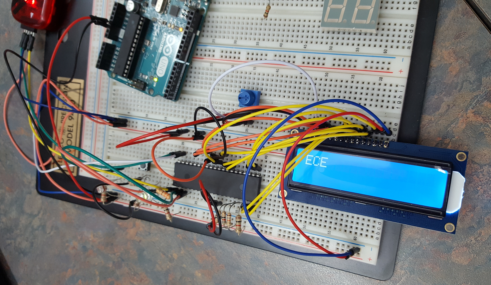
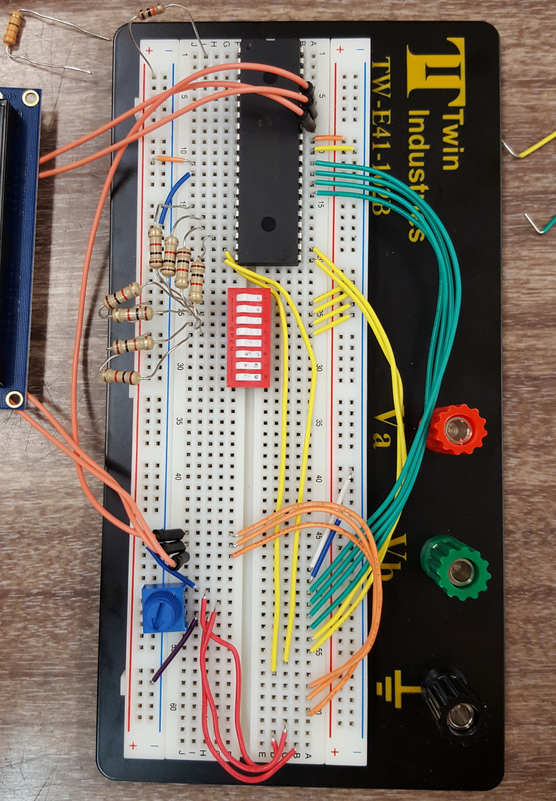

# Morse Code Light Sensor
A morse code to ascii display reader implemented on a PIC18F4321 for my Microcontrollers undergrad class.

Example using the push button to terminate a Morse code sequence to specify each letter. Note, the Arduino Uno was used only as a power source.

# C Implementation
A Morse code reader implemented in C through a console application where the user can input series of 0's or 1's and an enter keypress.

# Arduino Implementation
The C implementation controlled with a photoresistor and a repeating timer on an Arduino, outputting converted 0's and 1's to ascii letters on the serial monitor.

# PIC18F4321 Implementation
The Arduino implementation modified to work on the PIC outputting to a Hitachi LCD display with a button to control word endings and an LED to indicate when input will be read.

# General Layout

Layout connecting the PIC to the display. Note the Hitachi display is connected to row E, shifted to the edge at 63.
